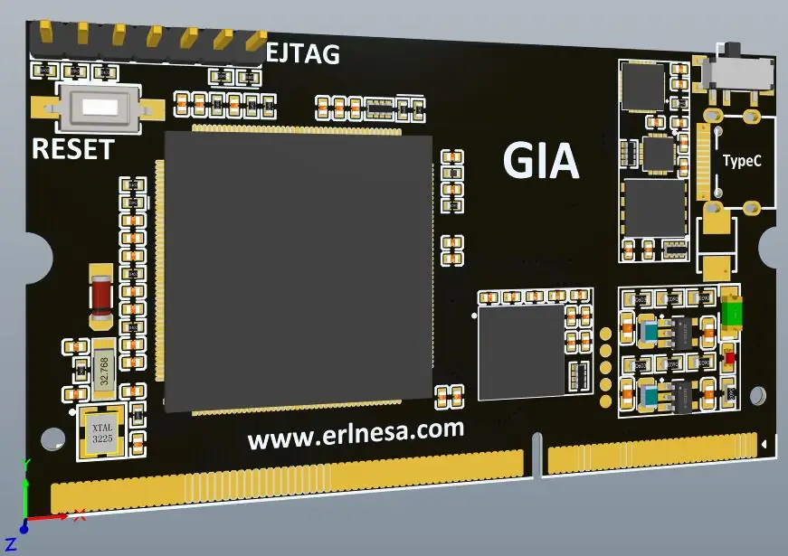
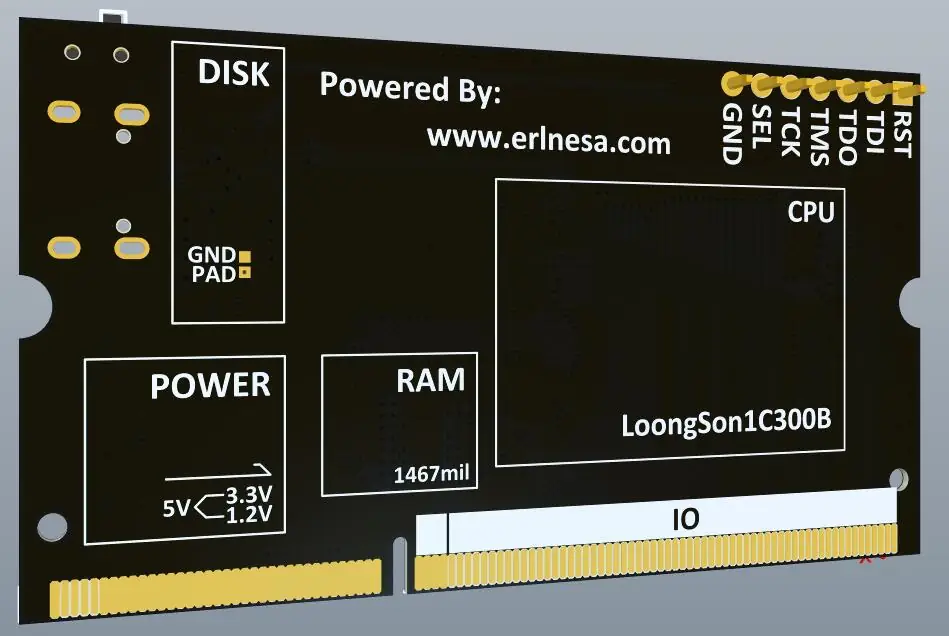

[前情提要](http://erlnesa.com/2021/10/%E9%BE%99%E8%8A%AF1C300B%E6%A0%B8%E5%BF%83%E6%9D%BF/)

## 简介

之前设计了龙芯1C300B的核心板，后来发现大小还能继续压缩，于是有了这个升级版。

相较于上个版本，依然是四层板。但压缩度更高，尺寸更小。

目前的长宽为：3.82cm X 6.72cm

更换了大多数芯片的封装，把所有的元件全部放置在了PCB正面方便手工焊接。

<!--more-->

## 进度

进度持续更新中......

（2021/10/25）开工程，总结1.0版本的痛点和四层板经验，器件选型。

（2021/10/26）绘制原理图，完成元件位置的初步布局，走线完成60%。

（2021/10/27）SDRAM到龙芯1C的所有信号线都做了±5mil内的等长布线。

（2021/10/27）PCB Layout完成，上传了嘉立创进行打样。[原理图](http://erlnesa.com/pdf_file/DDR3_LoongSon_2.pdf)

