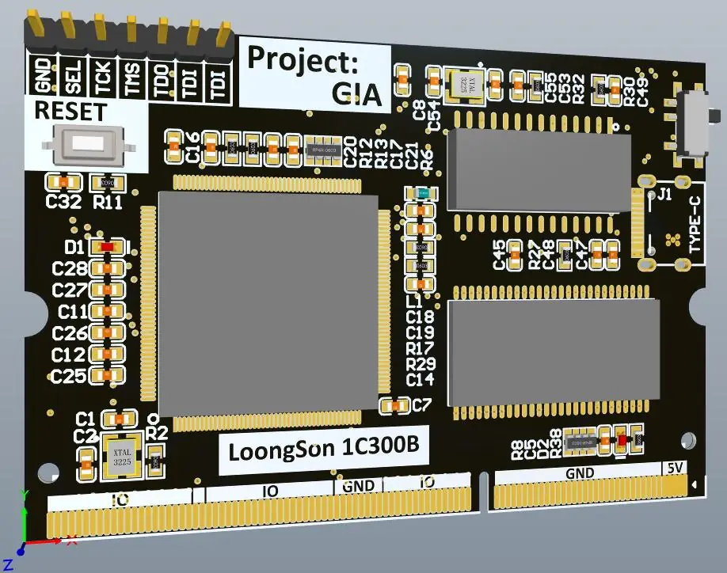
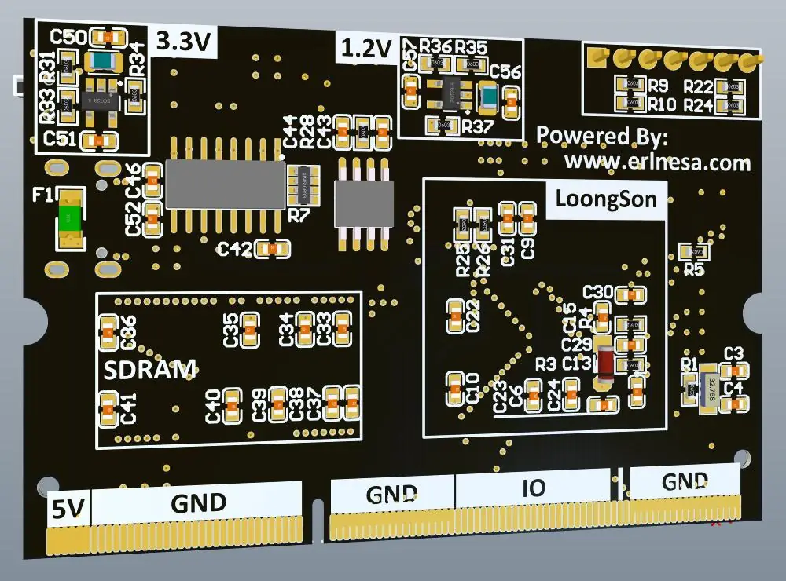
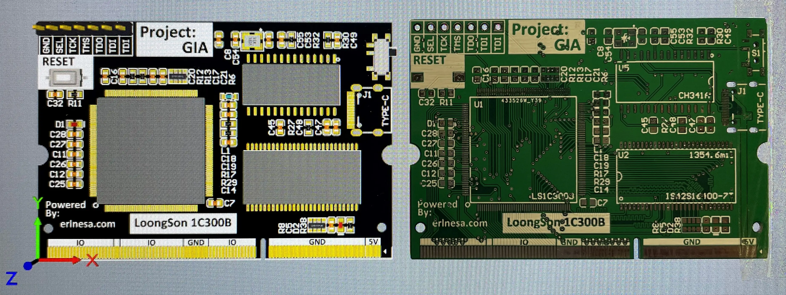

## 简介

这是一个搭载了龙芯1C300B处理器的**SOM**（System On Module），使用DDR3接口引出了全部引脚。

在一块核心板上集成了**龙芯1C300B**、8M的**SDRAM**、8MB的**NOR Flash**、**1.2V和3.3V电源**。同时它的体积也被我压缩到了笔记本**DDR3内存条大小**。

因此我可以在未来我的任何项目上简单的使用这块核心板，而不需要再绘制核心部分PCB、各种电压的DCDC。

这就节省了大量重复造轮子的时间。

在设计上，这个核心板采用了软件开发中**高内聚低耦合**的思想，把一块PCB上负责不同功能类的电路**模块化**，然后在一块载板上互相连接。

这样既提高了后续项目的**开发效率**，又提高了**维修便利性**。

DDR3接口在引脚多的同时，较为**廉价**（一个笔记本DDR3的母座在TB上只需要三块钱就可以买到），因此DDR3接口在众多接口的横向比较中脱颖而出成为了这个核心板的对外接口。

在使用方面，因为已经集成了电源模块，因此只需要向核心板提供5V供电，板子就能正常工作。

因此，在未来的项目里如果要使用龙芯，只需要一个笔记本DDR3母座，然后向它提供5V电源就可以了。

在制作方面，核心板没有使用任何不便于手工焊接的封装，利用锡膏、风枪和烙铁就可以很方便的焊接出来投入使用了。

<!--more-->

## 进度

进度持续更新中......

（2021/10/11）开工程，从开源项目[龙芯1C白菜板](https://gitee.com/caogos/OpenLoongsonLib1c)中迁移元件封装库。

（2021/10/12）绘制原理图，完成元件位置的初步布局。

（2021/10/13）SDRAM到龙芯1C的所有信号线都做了±5mil内的等长布线。

（2021/10/17）PCB Layout完成，上传了嘉立创进行打样。[原理图](http://erlnesa.com/pdf_file/DDR3_LoongSon.pdf)

（2021/10/27）收到样片，发现之前生成Gerber文件时忘记对过孔进行盖油处理。裸板效果图如下：

（2021/10/27）绘制了压缩度更高的2.0版本，上传嘉立创进行打样，2.0版本介绍：[这里](http://erlnesa.com/2021/10/%E9%BE%99%E8%8A%AF1C%E6%A0%B8%E5%BF%83%E6%9D%BF%E5%8E%8B%E7%BC%A9%EF%BC%882-0%EF%BC%89/)。效果图如下：

